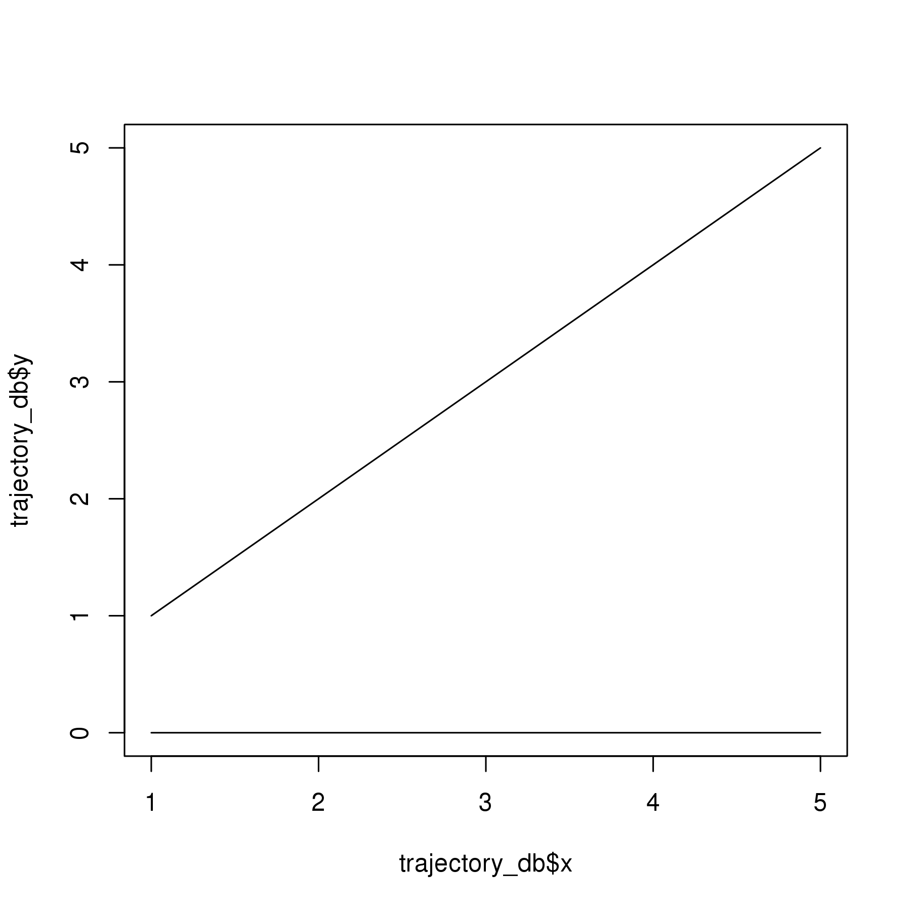
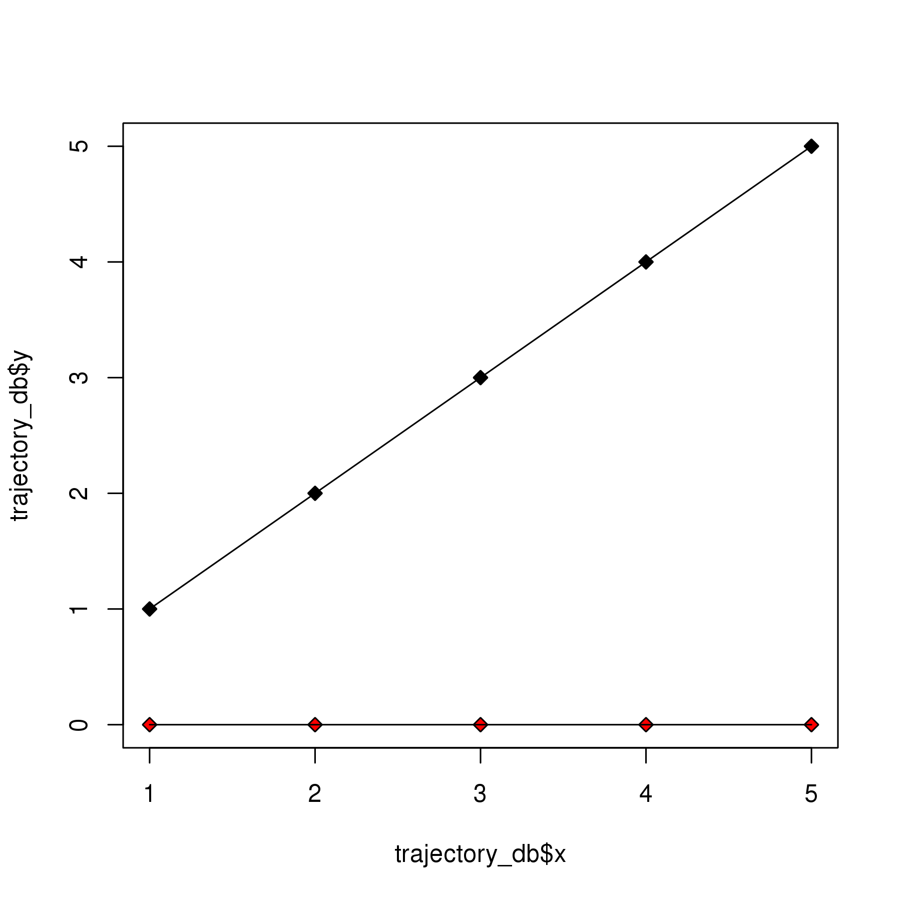
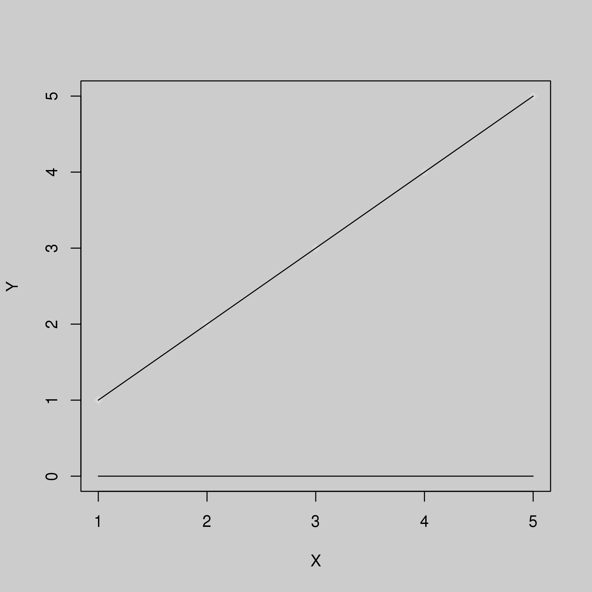
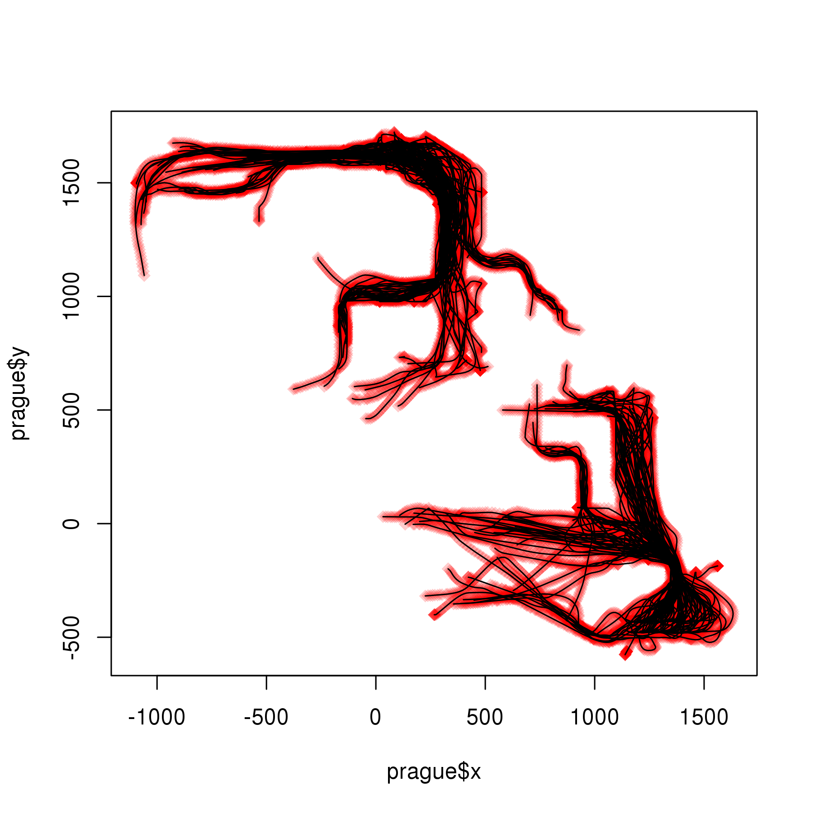

# Trajectory Computing in R

Welcome to the R interface for libTrajcomp. libTrajcomp is a header-only
C++ library implementing many trajectory computing algorithms on top of 
C++11 concepts like associative containers and iterators. 
<!---For details
on the implementation of these trajectories, consider the documentation
of libtrajcomp [libTrajcomp](http://www.trajectorycomputing.com/doc).
-->

This tutorial describes in a very informal way, how you can use these
algorithms from R in your data analysis projects. In this tutorial,
we will skip over a lot of details including the algorithms. <!--- However,
you find a good introduction into trajectory computing algorithms on the
website [trajectorycomputing.com](http://www.trajectorycomputing.com).
-->

# Spatial Trajectory Representation

For the trajectory computing library R interface, we decided to 
use an interface based on data frames. For the current version, we expect
trajectories to be essentially in two-dimensional space. Locations are given
by two coordinates x and y or by latitude and longitude.

Trajectories, for our library, can be either in an orthogonal coordinate
system. In this case, we name the spatial columns x and y. Alternatively,
trajectory data can be processed in WGS84. In 
this case, we name coordinates lat and lon for latitude and longitude
respectively.

The public interface automatically switches between implementations for
these two representations choosing the right distance measures. Some functions,
which are not yet implemented for lat/lon will issue warnings or errors. 

As trajectory computing is usually concerned with databases of many trajectories,
we want to represent those as single R objects and follow the classical convention
from plotting libraries in which between two different trajectories (or linestrings) 
a row of NaN values is inserted. In this way, we can pass complete trajectory
databases to most plotting subsystem without looping over individual trajectories
greatly increasing performance.

Let us look at an example: Two trajectories representing a horizontal line and a diagonal
line can be defined as follows:

```r
library(trajcomp); 
diagonal = data.frame(x=1:5,y=1:5);
horizontal=diagonal;
horizontal$y = 0;

trajectory_db = rbind(diagonal,c(NaN,NaN),horizontal);
print(trajectory_db);
```

```
##      x   y
## 1    1   1
## 2    2   2
## 3    3   3
## 4    4   4
## 5    5   5
## 6  NaN NaN
## 7    1   0
## 8    2   0
## 9    3   0
## 10   4   0
## 11   5   0
```

Now, trajectory_db contains both trajectories and it is often needed to
get the individual trajectories. Therefore, we provide a convenience
function, which can be used to add an index column to a dataset of 
trajectories. This index column can then be used along with standard
R approaches including split from R core and ddply from the package
plyr.

The following code illustrates this:


```r
trajectory_db$tid = getTrajectoryIDs(trajectory_db);
print(trajectory_db);
```

```
##      x   y tid
## 1    1   1   1
## 2    2   2   1
## 3    3   3   1
## 4    4   4   1
## 5    5   5   1
## 6  NaN NaN NaN
## 7    1   0   2
## 8    2   0   2
## 9    3   0   2
## 10   4   0   2
## 11   5   0   2
```

```r
trajectories = split(trajectory_db,f=trajectory_db$tid);
print(trajectories);
```

```
## $`1`
##   x y tid
## 1 1 1   1
## 2 2 2   1
## 3 3 3   1
## 4 4 4   1
## 5 5 5   1
## 
## $`2`
##    x y tid
## 7  1 0   2
## 8  2 0   2
## 9  3 0   2
## 10 4 0   2
## 11 5 0   2
## 
## $`NaN`
##     x   y tid
## 6 NaN NaN NaN
```

This gives a list and you can use this list as in the following
examples:


```r
d1 = trajectories[[1]] # This gives the diagonal
d = trajectories[[sample(1:length(trajectories),1)]] # This gives one random trajectory
print(d1);
```

```
##   x y tid
## 1 1 1   1
## 2 2 2   1
## 3 3 3   1
## 4 4 4   1
## 5 5 5   1
```

```r
print(d);
```

```
##     x   y tid
## 6 NaN NaN NaN
```

One problem in this context is that split also collects all NaNs and puts them
into an additional list entry. Therefore, the library provides a convenience
function tsplit (for trajectory splitting), which splits the trajectory dataset
into a list of trajectories and removes this garbage.


```r
trajectories = tsplit(trajectory_db);
print(trajectories);
```

```
## $`1`
##   x y tid
## 1 1 1   1
## 2 2 2   1
## 3 3 3   1
## 4 4 4   1
## 5 5 5   1
## 
## $`2`
##    x y tid
## 7  1 0   2
## 8  2 0   2
## 9  3 0   2
## 10 4 0   2
## 11 5 0   2
```


# Basic Plotting

As already explained, we choose this single object representation for 
efficient plotting and simple representation. You can plot a complete
database of trajectories directly as follows:


```r
plot(trajectory_db$x,trajectory_db$y,t="l");
```



Due to the chosen representation, it is easy to integrate color
into the plot, for example, we can let the index of the trajectory
decide the color - so that any trajectory gets its own color as follows:


```r
 trajectory_db$color = getTrajectoryIDs(trajectory_db);
 print(trajectory_db);
```

```
##      x   y tid color
## 1    1   1   1     1
## 2    2   2   1     1
## 3    3   3   1     1
## 4    4   4   1     1
## 5    5   5   1     1
## 6  NaN NaN NaN   NaN
## 7    1   0   2     2
## 8    2   0   2     2
## 9    3   0   2     2
## 10   4   0   2     2
## 11   5   0   2     2
```

```r
 plot(trajectory_db$x,trajectory_db$y,pch=23, bg=trajectory_db$color)
 lines(trajectory_db$x,trajectory_db$y);
```



We also provide a flexible plotting method in the library, which puts a
transparent color from a heatmap palette into the background. Note that
this function changes the palette and some plot settings and might affect
later plot overlays.


```r
cscale <- function(Q) #TODO => lib
{
   carea = quantile(Q,c(0,1), na.rm = TRUE)
   Q = Q - carea[1];
   Q = Q / (carea[2]-carea[1]);
   print(Q)
   Q[Q<0] = 0;
   Q[Q>1] = 1;
   return (Q*1023);
}
trajectory.heatplot<-function(Q,heatvec,...) # todo => lib
{
    par(bg="#cccccc");
    palette(adjustcolor(heat.colors(1024),alpha=0.2));
	cscaled = 1023 - cscale(heatvec);
	plot(Q$x, Q$y,xlab="X", ylab="Y", pch=23,col="#00000000",bg=cscaled,...);
	lines(Q$x,Q$y)

}

trajectory.heatplot(trajectory_db,trajectory_db$color);
```

```
##       [,1]
##  [1,]    0
##  [2,]    0
##  [3,]    0
##  [4,]    0
##  [5,]    0
##  [6,]  NaN
##  [7,]    1
##  [8,]    1
##  [9,]    1
## [10,]    1
## [11,]    1
```



## A computer game dataset

We chose a simple, small and high-quality dataset of computer game traces
in order to illustrate the library. Two teams play an ego shooter (e.g, Urban
Terror on the map prague2) and start
in different locations. We use the beginnings of player trajectories. In this
way, we have a dataset with two clusters around the starting points of both teams.

```	


```r
data(prague);
plot(prague$x,prague$y,pch=23, bg="#ff000033",col="#00000000");
lines(prague$x,prague$y);
```



# Trajectory Computing Examples
As already noted in the introduction, this is not intended to explain trajectory
computing. Instead, we want to show, how to use the library for the most
common tasks in trajectory computing. If you need information on algorithms
and approaches, consider using Google Scholar to find the original publications
or read a textbook such as the edited book [Computing with Spatial Trajectories](TODO).

## Preprocessing Algorithms
### Douglas Peucker simplification
Douglas Peucker is an algorithm for creating sketches of trajectories. Therefore, it
starts with a sketch containing only the first and last point. Then it iteratively
adds the point that has the largest error (often an orthogonal distance between the point
and the current sketch is used) until the largest error falls below a threshold $\epsilon$.


```r
data(prague);
p=tsplit(prague);
print(length(p))
```

```
## [1] 276
```

```r
browser();
```

```
## Called from: eval(expr, envir, enclos)
```

```r
print("todo: provide final interface for trajcomp");
```

```
## [1] "todo: provide final interface for trajcomp"
```

## Segmentation
## Distance Measures
## Trajectory Clustering (traclus)

# Outlook


